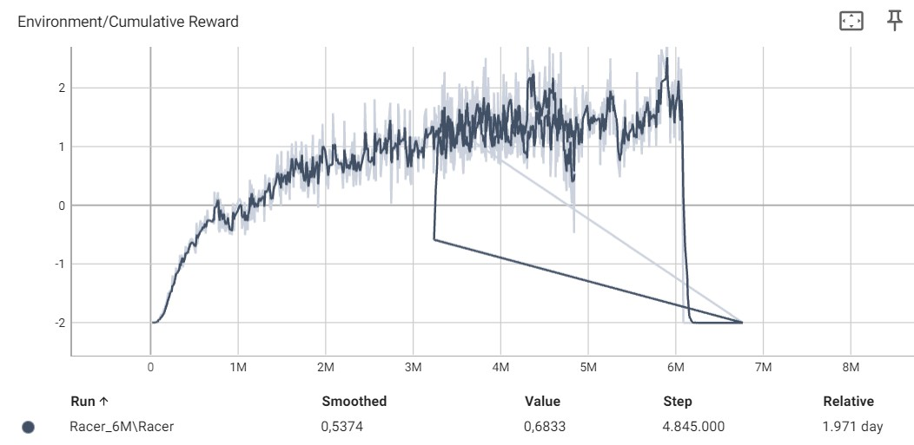

# Race Platformer

Team Samenstelling:
- Muhammed Ordu
- Eli Vermeulen
- Bram Van Goethem
  
## Inleiding

In dit project hebben we een Race Platformer ontwikkeld waarbij ML-agents leren 'charged jumpen' over verschillende afstanden tussen platforms in een virtual reality (VR) omgeving. De speler neemt deel aan de race in VR en moet concurreren met deze ML-agents. De focus ligt op het trainen van de ML-agents om hun sprongen te optimaliseren door middel van machine learning, en het creëren van een interactieve en uitdagende ervaring voor de speler.

## Methoden

Voor dit project gebruiken we Anaconda voor het trainen van de machine learning agents. De ontwikkelomgeving wordt gerealiseerd in Unity, terwijl TensorBoard wordt ingezet om de trainingsresultaten overzichtelijk te visualiseren en de voortgang van de agent te monitoren.

## Tutorial

Hieronder vind je een uitgebreide tutorial waarin stap voor stap wordt uitgelegd hoe je de code van ons race platformer spel kunt implementeren, de spelomgeving kunt opzetten en de AI-agents kunt trainen. Na het doorlopen van deze tutorial ben je vertrouwd met het werken met Anaconda voor het trainen van ML-agents, Unity voor het ontwikkelen van de omgeving, en TensorBoard voor het visualiseren van de trainingsresultaten. Je zult in staat zijn om je eigen VR-race platformer te creëren en verder te ontwikkelen.

### Installatie

- Anaconda (Python): versie 3.9.19
- Unity: versie 2022.3.10f1

### Verloop van de simulatie of het spel

In ons VR-race platformer spel begint de speler samen met ML-agents op een startplatform. Het doel is om zo snel mogelijk door een reeks van platforms te navigeren en als eerste de finish te bereiken. De ML-agents en de speler moeten 'charged jumps' uitvoeren om verschillende afstanden tussen platforms te overbruggen. De snelheid en precisie van deze sprongen bepalen de uitkomst van de race.

### Omgeving opzetten

Hieronder een beknopte uitleg over hoe je de omgeving kan implementeren en de agent vervolgens kan trainen.

1. Clone de git repo met de onderstaande commando:
```
git clone https://github.com/AP-IT-GH/eindproject-bram1305-MaMi364-EliNetor
```
2. Vervolgens open je de Unity hub en klik je op "Open project". Je navigeert vervolgens naar de map waarin je de repo gepulled hebt en je kiest de repo als project.
3. Start het project op
4. Navigeer in de unity venster naar Scenes en ga naar de "Training" scene. Deze scene is gemaakt om de agent te trainen

### Agent Training

In dit stappenplan wordt beknopt uitgelegd hoe je de agent kan trainen met behulp van Anaconda.

1. Maak een nieuwe anaconda omgeving en selecteer de juiste Python versie.
2. Start de terminal
3. Installer de benodigde packages met volgende commando's:
```
pip3 install torch~=1.7.1 -f https://download.pytorch.org/whl/torch_stable.html
python -m pip install mlagents==0.30.0
```
4. Nu kun je starten met de training
5. Start de training, navigeer naar de pad van de config file dat in je geclonede repo zit
```
mlagents-learn path/to/config.yaml --run-id=Racer
```
6. Je kunt op TensorBoard de resultaten bekijken. Voer de volgende commando uit om TensorBoard te starten:
```
tensorboard --logdir results --port 6006
```

### Observaties, Acties en Beloningen

- Observaties: Afstand tot het volgende platform, Jump force, Forward force, Max jump force, Tijd dat hij niet aan het jumpen is, X positie van de platform onder de agent, X positie van het volgende platform
- Acties: Charged jumpen, hoe meer je de jump button vasthoudt hoe verder je jumped
- Positieve Beloningen: Kleine beloning voor het jumpen, grote beloning voor het springen op een platform.
- Negatieve Beloningen: Middelmatige negatieve beloning om 10 sec stil te staan, grote negatieve beloning voor het vallen

 ### Beschrijving van de Objecten

- Platforms: Verschillende afstanden en hoogtes, waarop zowel de speler als de AI-agents moeten landen.
- ML-Agents: Computergestuurde tegenstanders die leren door middel van machine learning.
- Speler: De gebruiker die in VR de race tegen de ML-agents aangaat.
- Powerups: 2 Verschillende powerups: Telepoort de speler naar een verdere platform, andere zet de andere spelers naar de vorige checkpoint

### Gedragingen van de Objecten

- ML-Agents: Trainen om sprongen te optimaliseren, aanpassen aan verschillende platformafstanden en concurreren tegen de speler.
- Speler: Bestuurt de sprongen in VR en moet de juiste kracht gebruiken om op de platforms te landen.

### One-Pager Informatie
#### Draaiboek:
De speler bestuurt een karakter in een virtuele omgeving, terwijl ze racen tegen ML-agents. De omgeving is dynamisch en verandert voortdurend, met obstakels, power-ups en andere uitdagingen. De speler moet hun reflexen en vaardigheden gebruiken om te winnen.
#### Competitie tegen ML-agents:
De AI-component in de race platformer game voegt aanzienlijke meerwaarde toe ten opzichte van de situatie zonder deze component door competitie met ML-agents mogelijk te maken. In een omgeving zonder AI zouden spelers alleen tegen zichzelf strijden, wat kan resulteren in een beperkte mate van uitdaging en groeimogelijkheden. Door de toevoeging van ML-agents kunnen spelers echter concurreren tegen geoptimaliseerde modellen die strategieën en technieken gebruiken die verder gaan dan menselijke capaciteiten. Dit daagt spelers uit om hun vaardigheden te verbeteren.
#### Immersive VR:
Het ontwikkelen van deze game in virtual reality maakt de ervaring buitengewoon meeslepend. Spelers voelen zich echt ondergedompeld in de virtuele wereld en ervaren het falen, zoals vallen, op een heel directe manier. Het voelt alsof ze er echt zijn, waardoor het spel nog intenser en boeiender wordt.
#### Interactie:
In de interactie van de race platformer game gaat het om de directe race tussen de speler, vertegenwoordigd door hun VR-controller, en de ML-agents. De speler moet navigeren door de verschillende obstakels en uitdagingen in het spel terwijl ze proberen om als eerste de finishlijn te bereiken. Het draait allemaal om timing, behendigheid en het vinden van de beste route naar de overwinning.

## Resultaten

In het begin van de training zien we een significante stijging in prestaties, zoals weergegeven in de TensorBoard-grafieken. Na deze initiële stijging vertoont de grafiek echter enkele schommelingen, met periodes van zowel verbetering als achteruitgang. Rond de 6 miljoen stappen bereiken we een piek in de prestaties.

### Beschrijving van de TensorBoard-grafieken
De TensorBoard-grafieken tonen een duidelijk patroon van aanvankelijke groei, gevolgd door onregelmatige fluctuaties. De prestaties verbeteren snel in de eerste fasen van de training. Vervolgens ontstaan er ups en downs, wat wijst op een instabiele leerfase. Opmerkelijk is dat na 6.080.000 stappen de prestaties plotseling instorten, alsof de agent alle eerder geleerde vaardigheden is vergeten.

### Opvallende waarnemingen tijdens het trainen
- Initiële groei: Snelle verbetering in de eerste trainingsfasen.
- Fluctuaties: Perioden van zowel verbetering als verslechtering na de aanvankelijke stijging.
- Piek en ineenstorting: Een piek rond 6 miljoen stappen, gevolgd door een onverwachte daling na 6.080.000 stappen, zonder duidelijke oorzaak.
- Stoppen bij 6.8 miljoen stappen: Ondanks de instorting bij 6.080.000 stappen, hebben we de training voortgezet tot 6.8 miljoen stappen. Echter, we hebben uiteindelijk besloten om het model van 6 miljoen stappen te gebruiken vanwege de problemen op dat punt.

## Conclusie

In dit project hebben we een race platformer ontwikkeld waarbij ML-agents leren 'charged jumpen' in een VR-omgeving, getraind met behulp van Anaconda en gevisualiseerd met TensorBoard.

De resultaten tonen een initiële snelle verbetering in de prestaties van de AI-agents, gevolgd door fluctuaties en uiteindelijk een onverwachte ineenstorting na een bepaalde trainingsperiode. Ondanks deze uitdagingen hebben we een werkbaar model kunnen trainen.

De resultaten laten zien dat hoewel de ML-agents in staat zijn om effectief te leren en verbeteringen te tonen, er nog steeds onvoorspelbare elementen zijn in hun leerproces. Dit benadrukt de complexiteit van machine learning en de noodzaak voor voortdurende monitoring en aanpassing. De prestatievermindering op een later moment in de training wijst op mogelijke overtraining of andere onderliggende problemen die aangepakt moeten worden.

Voor toekomstige verbeteringen:
1. Meer verfijnde beloningsstructuren: Dit kan helpen om de training consistenter te maken en de schommelingen te verminderen.
2. Verschillende trainingsstrategieën: Het verkennen van technieken zoals curriculum learning, waarbij de moeilijkheidsgraad geleidelijk toeneemt, kan de leerervaring van de agents verbeteren.
